# Pneumonia Detection from Chest X-rays using Deep Learning

## 📌 Overview
This project applies **deep convolutional network** to classify chest X-ray images into **pneumonia** or **normal** categories. The network architecture choice was to take advantage of residual connections for good information propagation, avoiding the gradient vanishing problem.

Two state-of-the-art convolutional neural networks were fine-tuned:
- **ResNet50**
- **DenseNet161**

The work demonstrates how transfer learning, progressive training, and visualization techniques can improve medical image classification.

To know what region in the image is significant in the model's decision making, the project integrates **Class Activation Maps (CAMs)**, which highlight the regions of the X-ray that most influenced the model’s prediction. This step is critical in medical AI applications, making deep learning models transparent(i.e Not viewed as a blackbox function )and clinical relevance.


---

##  Methods
### Data Preparation
- Preprocessed over **6,000 chest X-ray images** downloaded from kaggle
- Applied **data augmentation** (flips, rotations, normalization) to improve generalization
- Split into training, validation, and test sets

### Model Training
- **Transfer Learning**: Used pretrained ImageNet weights for ResNet50 & DenseNet161
- **Progressive Unfreezing**: Gradually unfroze deeper layers for fine-tuning
- **Regularization**: Early stopping, dropout, and learning rate scheduling
- **Optimization**: Adam optimizer with tuned hyperparameters
- **Hardware**: GPU acceleration for efficient training

### Visualization
- Implemented **Class Activation Maps (CAMs)** using PyTorch forward hooks
- Highlighted **clinically relevant regions** influencing model predictions

---

### 📊 Results
- **DenseNet161** achieved **93.75% validation accuracy**
- **ResNet50** produced strong classification performance with interpretable CAMs

---

## Evaluation Summary of ResNet50
The ResNet50 model was evaluated using a test set of 624 chest X-ray images to assess the model's ability as a medical screening tool. The model achieved an **Accuracy of 83.97%** and **AUC of 0.925**.
One important thing to note is that the model has a perfect sensitivity (Recall = 1.0) for the pneumonia class by successfully classifying all pneumonia cases (390/390). However, this high sensitivity comes with a specificity trade-off, resulting in a number of False Positives (Normal images predicted as Pneumonia).

### Confusion Matrix Analysis

    
<p align="center"> 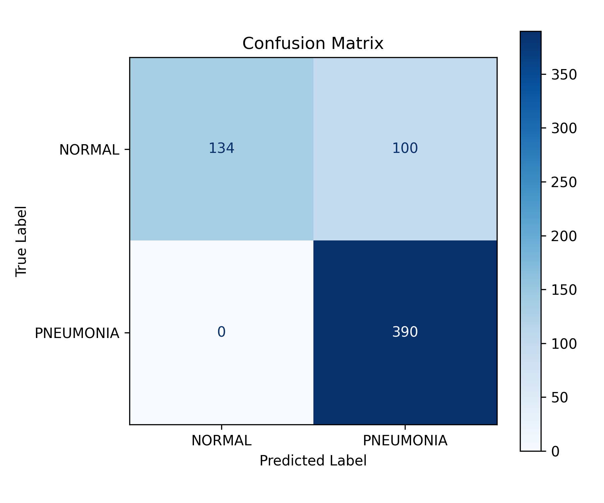 </p>
    

- True Positives (390): The model correctly classified every case of pneumonia in the test set.
- False Negatives (0): There were zero missed diagnoses. In a medical context, this is the most valuable metric, as missing a sick patient can have fatal consequences.
- False Positives (100): The model incorrectly classified 100 healthy patients as having pneumonia due to its high sensitivity.
- True Negatives (134): The model correctly classified 134 cases of healthy people.
  
### Quantitative Performance Metrics
| Metric    | Normal (0)   | Pneumonia (1)   | Interpretation                                                                 |
|:----------|:----------------|:------------------|:-------------------------------------------------------------------------------|
| Precision | 1.00            | 0.80              | When the model predicts "Normal," it is 100% correct. When it predicts "Pneumonia," it is 80% correct. |
| Recall    | 0.57            | 1.00              | The model found all pneumonia cases, but only successfully identified 57% of the normal cases. |
| F1-Score  | 0.73            | 0.89              | The model has a good balance between precision and recall for healthy and unhealthy cases. |

### ROC Curve Analysis

<p align="center"> 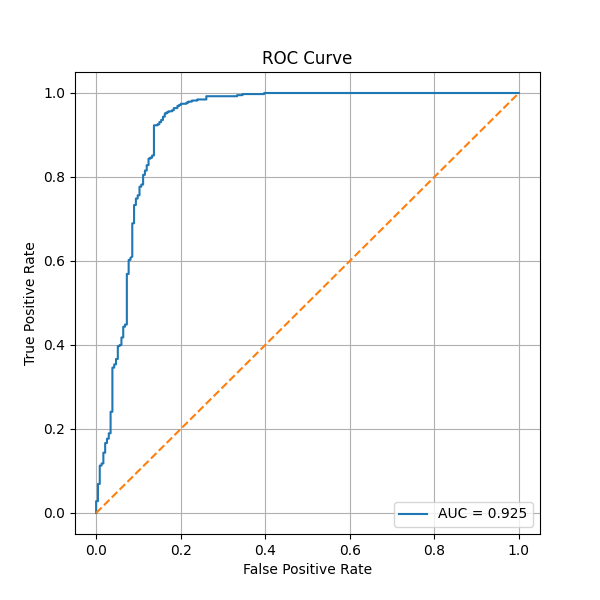 </p>

AUC Score of 0.925 means the model is good at disguising between normal and pneumonia chest X-rays.

### Clinical Strengths
Clinically, this model is an excellent diagnostic tool. It can confidently tell a doctor who does not have pneumonia, ensuring no sick patient is sent home by mistake.

### Clinical Weakness
The model weakness is overdiagnosis, flagging ~43% of healthy patients as sick. This creates a higher workload for radiologists to verify the results.

```python

import torch
import matplotlib.pyplot as plt
from resnet_model import ResNet50

```


```python
resnet = ResNet50()

resnet.print_result(
    model_path='best_model_full_ResNet50.pt', 
    image_folder_path='chest_xray1' 
)
```

    /home/ubuntu/.venv/lib/python3.12/site-packages/torchvision/models/_utils.py:208: UserWarning: The parameter 'pretrained' is deprecated since 0.13 and may be removed in the future, please use 'weights' instead.
      warnings.warn(
    /home/ubuntu/.venv/lib/python3.12/site-packages/torchvision/models/_utils.py:223: UserWarning: Arguments other than a weight enum or `None` for 'weights' are deprecated since 0.13 and may be removed in the future. The current behavior is equivalent to passing `weights=ResNet50_Weights.IMAGENET1K_V1`. You can also use `weights=ResNet50_Weights.DEFAULT` to get the most up-to-date weights.
      warnings.warn(msg)
    

    *****************************
    (2, 2048)
    *****************************
    Image index 0: Actual NORMAL, Predicted NORMAL
    


    
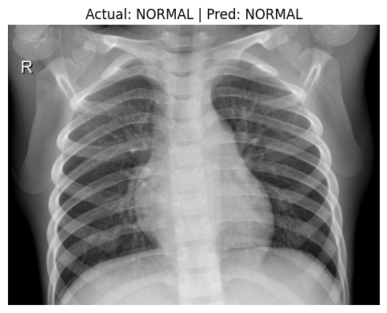
    


    
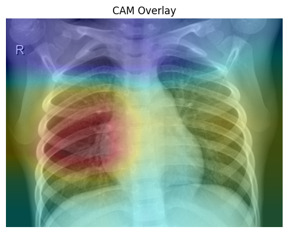
    


    *****************************
    (2, 2048)
    *****************************
    Image index 1: Actual NORMAL, Predicted PNEUMONIA
    


    
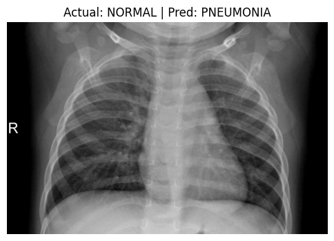
    


    
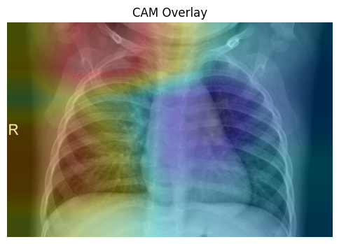
    


    *****************************
    (2, 2048)
    *****************************
    Image index 2: Actual NORMAL, Predicted NORMAL
    


    
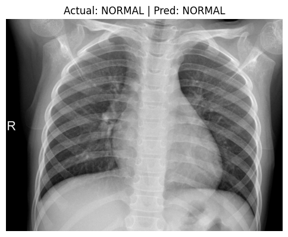
    


    
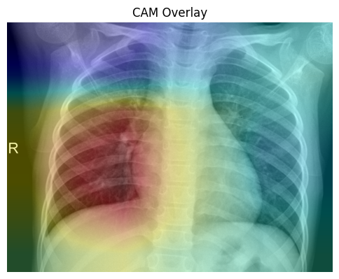
    


    *****************************
    (2, 2048)
    *****************************
    Image index 3: Actual NORMAL, Predicted PNEUMONIA
    


    
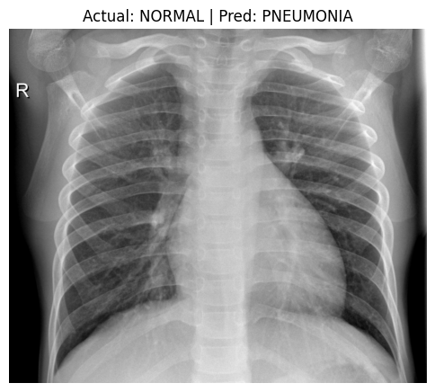
    


    
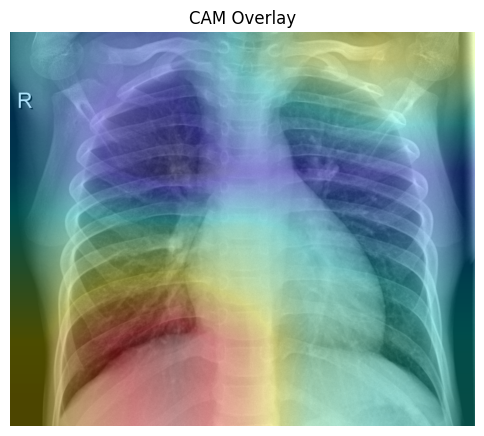
    


    *****************************
    (2, 2048)
    *****************************
    Image index 4: Actual PNEUMONIA, Predicted PNEUMONIA
    


    
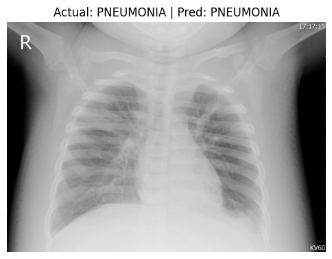
    


    
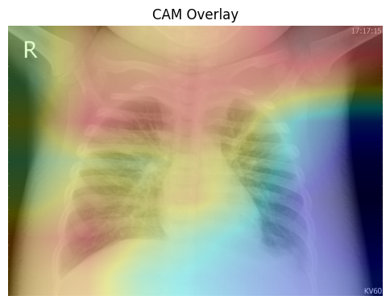
    


    *****************************
    (2, 2048)
    *****************************
    Image index 5: Actual PNEUMONIA, Predicted PNEUMONIA
    


    
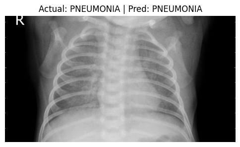
    


    
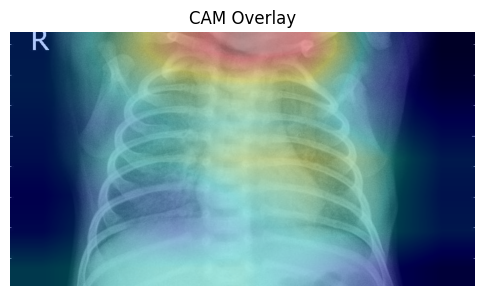
    


    *****************************
    (2, 2048)
    *****************************
    Image index 6: Actual PNEUMONIA, Predicted PNEUMONIA
    


    
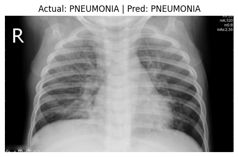
    


    
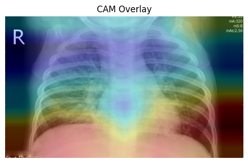
    


    *****************************
    (2, 2048)
    *****************************
    Image index 7: Actual PNEUMONIA, Predicted PNEUMONIA
    


    
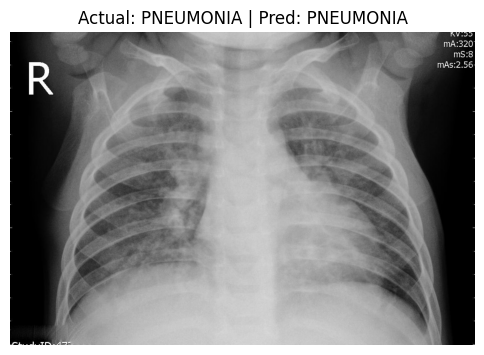
    


    
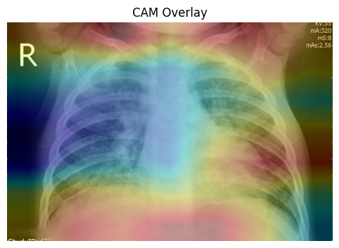
    


    *****************************
    (2, 2048)
    *****************************
    Image index 8: Actual PNEUMONIA, Predicted PNEUMONIA
    


    
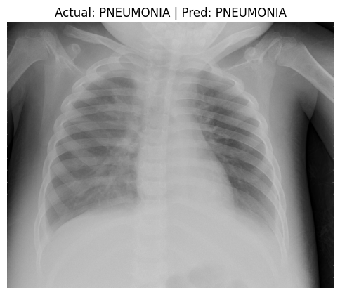
    


    
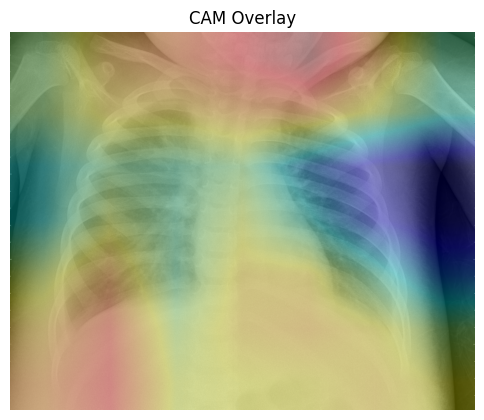
    


